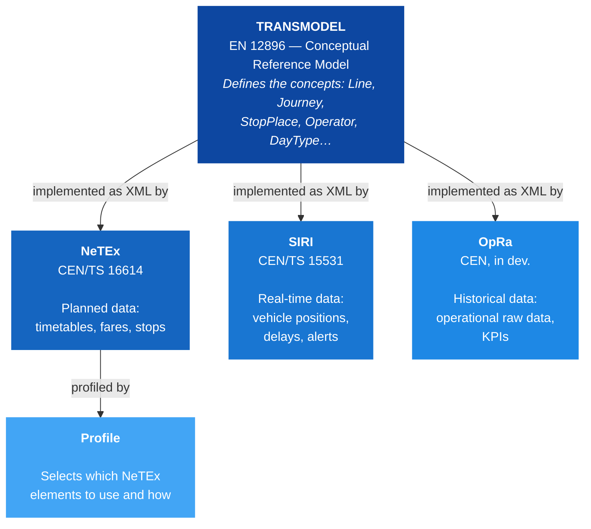
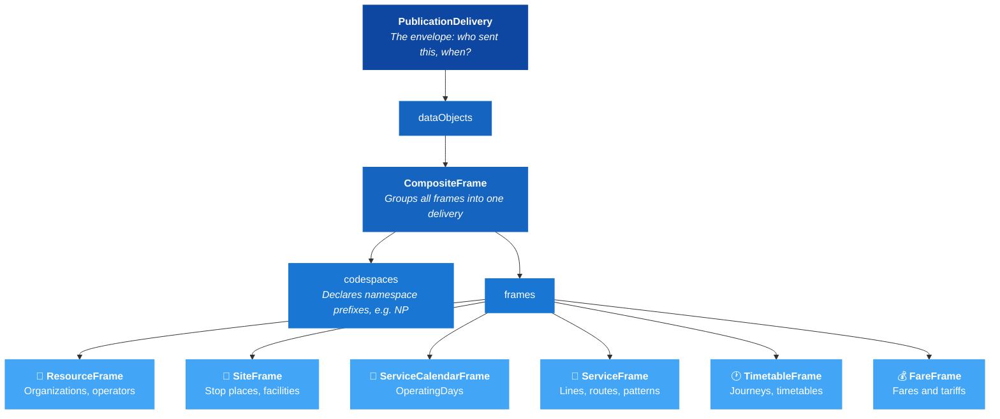
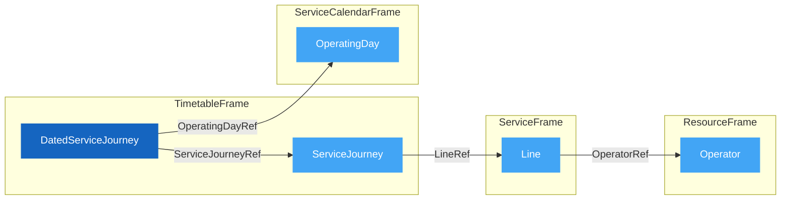

# 🚀 Get Started with NeTEx

## 1. 🎯 Introduction

This guide is for anyone working with public transport data — whether you're a developer integrating timetable feeds, a data manager at a transport authority, or an analyst exploring how NeTEx structures information.

Public transport systems across Europe need to exchange planned data — timetables, stop infrastructure, fares, vehicle schedules — between authorities, operators, and journey planners. [NeTEx](https://github.com/NeTEx-CEN/NeTEx) provides a single, standardised XML format for all of this, eliminating custom integrations and making data interoperable across borders.

By the end of this guide, you'll understand where NeTEx comes from, how it's structured, and how to read a real NeTEx document.

In this guide you will learn:
- 🌍 What Transmodel is and how NeTEx implements it
- 📄 The anatomy of a NeTEx document
- 🏗️ How frames organize data into domains
- 🔍 How to read a real example step by step

---

## 2. 🌍 The Standards Family

NeTEx is one piece of a European standards ecosystem. Understanding where it fits helps you know what NeTEx covers — and what it doesn't.

### The Big Picture

NeTEx doesn't exist in isolation — it's part of a European standards family for public transport:



> [!TIP]
> Click any box to visit its standard. When you see a NeTEx element like `ServiceJourney`, it maps directly to the Transmodel concept of a "SERVICE JOURNEY". Transmodel defines the semantics, NeTEx defines the XML.

---

## 3. 📄 Anatomy of a NeTEx Document

Once you know the outer structure, every NeTEx file becomes predictable. Here's the pattern they all follow:



### Key Concepts

**PublicationDelivery** is always the root element. It contains metadata (timestamp, participant) and wraps all data in `dataObjects`.

**CompositeFrame** groups multiple frames into a single delivery unit. Think of it as a "package" — all frames inside can reference each other.

**Frames** separate data by domain. Each frame type holds a specific kind of data. This separation means you can update timetables without touching stop data, or change fares without republishing routes.

For details, see the [CompositeFrame documentation](../../Frames/CompositeFrame/Description_CompositeFrame.md).

---

## 4. 🏗️ Frames and What They Contain

Each frame type owns a specific domain of transport data. You only include the frames your delivery needs.

| Frame | Transmodel Domain | What It Holds | Example Objects |
|-------|-------------------|---------------|-----------------|
| [ResourceFrame](../../Frames/ResourceFrame/Description_ResourceFrame.md) | Organizations | Shared resources used by all other frames | Operator, Authority, VehicleType |
| [SiteFrame](../../Frames/SiteFrame/Description_SiteFrame.md) | Fixed Objects | Physical infrastructure | StopPlace, Quay, Parking |
| [ServiceCalendarFrame](../../Frames/ServiceCalendarFrame/Description_ServiceCalendarFrame.md) | Calendar | When services operate (explicit dates) | OperatingDay, OperatingPeriod |
| [ServiceFrame](../../Frames/ServiceFrame/Description_ServiceFrame.md) | Network | Route structure and stop assignments | Line, Route, JourneyPattern, ScheduledStopPoint |
| [TimetableFrame](../../Frames/TimetableFrame/Description_TimetableFrame.md) | Timetable | Journey scheduling | ServiceJourney, DatedServiceJourney |
| [FareFrame](../../Frames/FareFrame/Description_FareFrame.md) | Fares | Pricing and products | FareZone, TariffZone |

> [!TIP]
> You don't need all frames in every delivery. A stop registry might only use SiteFrame. A timetable exchange might use ServiceCalendarFrame + ServiceFrame + TimetableFrame. Include only what's relevant.

---

## 5. 🔍 Reading Your First Example

The best way to learn NeTEx is to read real XML. Let's walk through a minimal delivery with four frames and see how they connect:

📄 **Full file:** [Example_CompositeFrame.xml](../../Frames/CompositeFrame/Example_CompositeFrame.xml)

### The Envelope

```xml
<PublicationDelivery xmlns="http://www.netex.org.uk/netex" version="2.0">
  <PublicationTimestamp>2026-03-18T00:00:00Z</PublicationTimestamp>
  <ParticipantRef>ENT</ParticipantRef>
  <dataObjects>
    <CompositeFrame id="NP:CompositeFrame:1" version="1">
```

- `PublicationDelivery` — always the root element, with the NeTEx namespace
- `ParticipantRef` — identifies who created this delivery
- `CompositeFrame` — wraps all frames; the `id` uses the format `Codespace:Type:Identifier`

> [!NOTE]
> All NeTEx identifiers follow the pattern `Codespace:ObjectType:Identifier` — for example `NP:OperatingDay:20260318` or `NP:ServiceJourney:15044`. The codespace declares who owns the data.

### Shared Resources (ResourceFrame)

```xml
<ResourceFrame id="NP:ResourceFrame:1" version="1">
  <organisations>
    <Authority id="NP:Authority:AUT_001" version="1">
      <Name>Example Authority</Name>
    </Authority>
    <Operator id="NP:Operator:OP_001" version="1">
      <Name>Example Operator</Name>
    </Operator>
  </organisations>
</ResourceFrame>
```

- **Authority** — the public body responsible for transport (Transmodel: AUTHORITY)
- **Operator** — the company running the vehicles (Transmodel: OPERATOR)
- Other frames reference these by `id` — they don't repeat the definitions

### Calendar (ServiceCalendarFrame)

This profile uses **explicit operating days** — each calendar day a service runs is modelled as an `OperatingDay`, and each journey on that day is modelled as a `DatedServiceJourney`. `DayType`-based derivation is not used.

```xml
<ServiceCalendarFrame id="NP:ServiceCalendarFrame:1" version="1">
  <operatingDays>
    <OperatingDay id="NP:OperatingDay:20260318" version="1">
      <CalendarDate>2026-03-18</CalendarDate>
    </OperatingDay>
    <OperatingDay id="NP:OperatingDay:20260319" version="1">
      <CalendarDate>2026-03-19</CalendarDate>
    </OperatingDay>
  </operatingDays>
</ServiceCalendarFrame>
```

- **OperatingDay** is one concrete calendar date (Transmodel: OPERATING DAY)
- Journeys reference `OperatingDay` indirectly via `DatedServiceJourney` — this gives the source authority full control over which dates run, including exceptions.

### Network (ServiceFrame)

```xml
<ServiceFrame id="NP:ServiceFrame:1" version="1">
  <lines>
    <Line id="NP:Line:L1" version="1">
      <Name>Line 1</Name>
      <PublicCode>1</PublicCode>
      <OperatorRef ref="NP:Operator:OP_001"/>
    </Line>
  </lines>
</ServiceFrame>
```

- **Line** — a group of routes marketed as one service (Transmodel: LINE)
- `OperatorRef` points back to the ResourceFrame — this is how frames cross-reference

### Timetable (TimetableFrame)

```xml
<TimetableFrame id="NP:TimetableFrame:1" version="1">
  <vehicleJourneys>
    <ServiceJourney id="NP:ServiceJourney:SJ_001" version="1">
      <Name>Morning departure</Name>
      <LineRef ref="NP:Line:L1"/>
    </ServiceJourney>
  </vehicleJourneys>
  <datedServiceJourneys>
    <DatedServiceJourney id="NP:DatedServiceJourney:DSJ_001_20260318" version="1">
      <ServiceJourneyRef ref="NP:ServiceJourney:SJ_001"/>
      <OperatingDayRef ref="NP:OperatingDay:20260318"/>
    </DatedServiceJourney>
  </datedServiceJourneys>
</TimetableFrame>
```

- **ServiceJourney** — the planned trip pattern (Transmodel: SERVICE JOURNEY)
- **DatedServiceJourney** binds one `ServiceJourney` to one `OperatingDay` — a concrete trip on a concrete date
- `LineRef` links to the network; the calendar link goes through `DatedServiceJourney → OperatingDayRef`
- Everything connects through references, never by duplicating data

### How the References Connect



This is the core pattern in NeTEx: objects live in their own frame and connect through `*Ref` elements. Data is defined once and referenced everywhere.

---

## 6. 🧭 Where to Go Next

You now have the foundation. The natural next step depends on what you're trying to do.

**Pick one of the deeper-dive guides:**

- [Location Handling Guide](../LocationHandling/LocationHandling_Guide.md) — the UIC requirement, `privateCodes/PrivateCode[@type='uicCode']`, the TSDUPD/SKDUPD delivery contract, and per-station Minimum Connection Time. Most readers should start here.
- [Stable Identity Guide](../StableIdentity/StableIdentity_Guide.md) — why `id` is the long-term interoperability key and `uicCode` is intermediate; the three-layer model `id` / `privateCodes` / `Name`.
- [TSDUPD Converter Guide](../TSDUPD/TSDUPD_Converter_Guide.md) — how station data (SiteFrame + MCT) is transformed into EDIFACT TSDUPD.
- [SKDUPD Converter Guide](../SKDUPD/SKDUPD_Converter_Guide.md) — how ServiceJourney + DatedServiceJourney + OperatingDay become EDIFACT SKDUPD.
- [Validation Guide](../Validation/Validation.md) — schema setup, the most common errors, and a pre-commit checklist.
- [PrivateCode Type Conventions](../Validation/PrivateCode_Type_Conventions.md) — canonical `@type` tokens (`uicCode`, `reservationCode`, …).
- [Tools Guide](../Tools/Tools_Guide.md) — editor setup, validators, useful XPath utilities.
- [Glossary](../Glossary/Glossary.md) — quick lookup for terms.

**Browse the reference material:**

- [Frames](../../Frames/CompositeFrame/Description_CompositeFrame.md) — frame-level documentation
- [Objects](../../Objects/Line/Description_Line.md) — object-level documentation

**Topics worth a deeper look later:**

- The lifecycle of a `DatedServiceJourney` and how operating-day bitmasks are built — see SKDUPD Converter Guide § 2.
- Why platform-level (`Quay`) changes do not require a new TSDUPD baseline — see Location Handling Guide § 3.
- The `SiteConnection` self-loop pattern for per-station MCT — see Location Handling Guide § 4.
