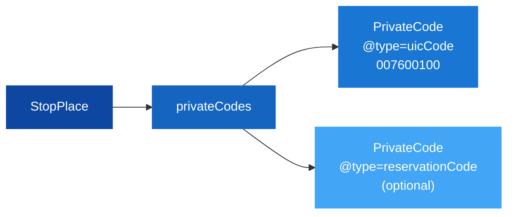
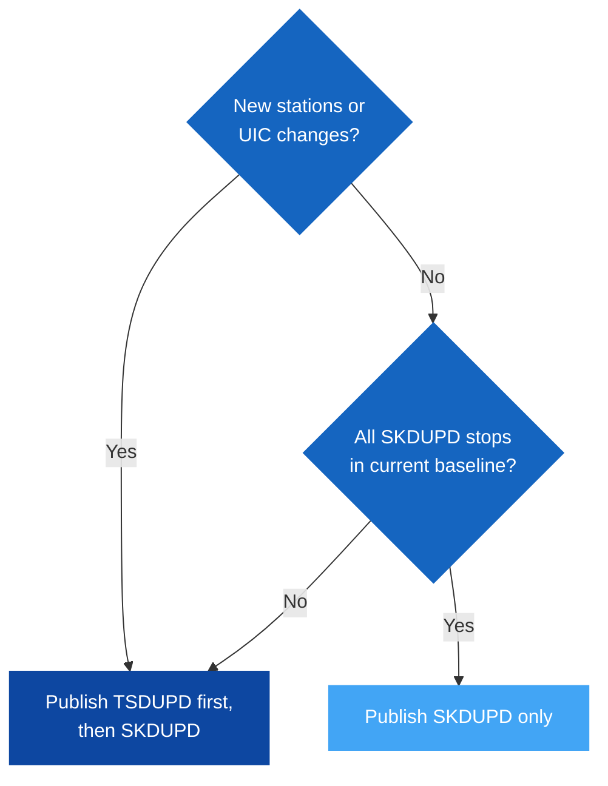
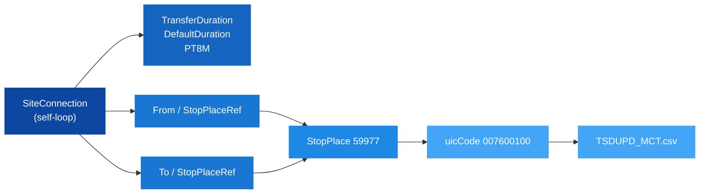

# 📍 Location Handling Guide

## 1. 🎯 Introduction

Every NeTEx delivery that involves stop locations — whether TSDUPD (station publication) or SKDUPD (timetable) — depends on one thing being consistently true: every stop can be uniquely identified by a stable, internationally recognised code. In the UIC EDIFACT world, that code is the **9-digit UIC station number**, and in NeTEx it lives in `privateCodes/PrivateCode[@type='uicCode']`.

This guide establishes the profile requirement, explains the format, and defines the delivery contract so that SKDUPD can be published independently when no station changes have occurred.

> [!NOTE]
> `privateCodes/PrivateCode[@type='uicCode']` is an **intermediate form**. The long-term direction is that downstream systems resolve stops via the stable NeTEx `id` (`NSR:StopPlace:59977`) directly, at which point the UIC code becomes a display attribute rather than the interoperability key. See the [Stable Identity Guide](../StableIdentity/StableIdentity_Guide.md) for the full architectural rationale.

In this guide you will learn:
- 🎯 Why `privateCodes/PrivateCode[@type='uicCode']` is mandatory in this profile
- 🧩 The 9-digit UIC format and how to read it
- 🗂️ The delivery contract between TSDUPD and SKDUPD
- ⏱️ How per-station Minimum Connection Time (MCT) is modelled in NeTEx
- 📝 Common mistakes and how to avoid them

---

## 2. 🧠 Core Concepts

### The location identity requirement

A StopPlace without a resolvable UIC code is invisible to MERITS EDIFACT consumers. The TSDUPD converter skips stops with no UIC. The SKDUPD converter emits a POR row with a blank UIC field, which downstream consumers cannot process.

The rule is simple:

> Every `StopPlace` used in a timetable or station delivery **must** carry a `privateCodes/PrivateCode[@type='uicCode']` containing a valid full 9-digit UIC station number.

This is not a NeTEx XSD requirement — it is a **profile requirement** of this data contract. Without it, the conversion pipeline has no basis for UIC assignment and the EDIFACT output is incomplete.

### The 9-digit UIC format

UIC station numbers in the MERITS world use a fixed **9-digit zero-padded** format. The 9-digit form is the **only valid form** in this profile — producers must zero-pad shorter values before publishing. The converter does not normalise.

Treat the 9 digits as an opaque identifier. Do not write code that decodes country codes or station ranges from substrings of the value; that pattern is exactly what this profile is moving away from (see [Stable Identity Guide](../StableIdentity/StableIdentity_Guide.md)).

### Why the typed container form is required

NeTEx v2.0 introduced `privateCodes` as a typed, multi-code container. The profile mandates this form for three reasons:

1. **Unambiguous type**: `@type='uicCode'` makes the code system explicit, not implied.
2. **Multi-code support**: The same StopPlace can carry `uicCode` and `reservationCode` in the same container without collision.
3. **Converter reliability**: The converters resolve UIC exclusively via `privateCodes/PrivateCode[@type='uicCode']`. Any StopPlace without this element will produce no UIC output.



---

## 3. 🧭 How It Works In NeTEx

### Required structure

Every StopPlace in a profile-compliant SiteFrame must include:

```xml
<StopPlace id="NSR:StopPlace:59977" version="1">
  <privateCodes>
    <PrivateCode type="uicCode">007600100</PrivateCode>
  </privateCodes>
  <Name lang="nor">Oslo S</Name>
  <TransportMode>rail</TransportMode>
</StopPlace>
```

The `privateCodes` container is declared `0..1` in XSD but is **1..1 in this profile** for any StopPlace that participates in a TSDUPD or SKDUPD delivery.

> [!NOTE]
> **Quay-level identity is out of scope for `uicCode`.** UIC numbers identify *stations*, not platforms. A `Quay` must therefore not carry `privateCodes/PrivateCode[@type='uicCode']`. Platform-level identity belongs in a dedicated platform code (future profile extension); today, platform information is only carried per departure.

### Resolution chain in SKDUPD conversion

The converter uses `uicCode` as the anchor for the entire stop-time resolution chain. There are two valid resolution paths from a `ScheduledStopPoint` to a `StopPlace`:

- **Quay path** (preferred for rail): `PassengerStopAssignment` resolves the `ScheduledStopPoint` to a `Quay`; the `Quay` is contained in a `StopPlace`.
- **Direct path**: `PassengerStopAssignment` resolves the `ScheduledStopPoint` directly to a `StopPlace` (no Quay involved).

```mermaid
flowchart LR
    SSP["ScheduledStopPoint"] -->|PassengerStopAssignment| Q["Quay (optional)"]
    SSP -.->|PassengerStopAssignment<br/>(direct)| SP["StopPlace"]
    Q -->|contained in| SP
    SP -->|uicCode| UIC["007600100"]
    UIC --> POR["POR.uic"]

    style SSP fill:#0D47A1,stroke:#0D47A1,color:#fff
    style Q fill:#1565C0,stroke:#1565C0,color:#fff
    style SP fill:#1976D2,stroke:#1976D2,color:#fff
    style UIC fill:#1E88E5,stroke:#1E88E5,color:#fff
    style POR fill:#42A5F5,stroke:#42A5F5,color:#fff
```

In both paths the chain terminates at `StopPlace/privateCodes/PrivateCode[@type='uicCode']`. A break anywhere in the chain — missing `PassengerStopAssignment`, an unresolvable `Quay`/`StopPlace` reference, or a missing `uicCode` on the `StopPlace` — produces a POR row with a blank UIC. The converter logs this as "stops without UIC" and continues, but the resulting SKDUPD is incomplete for those stops.

### The TSDUPD / SKDUPD delivery contract

TSDUPD and SKDUPD are published independently. The contract is:

**SKDUPD-only delivery is permitted when:**

- Every ScheduledStopPoint referenced in the timetable resolves to a StopPlace UIC that exists in the currently active TSDUPD baseline.
- No new stops or platform changes have been introduced since the last TSDUPD publication.

**A new TSDUPD delivery is required when:**

- A new station is added or renamed.
- A UIC code changes.
- Any stop referenced by an upcoming SKDUPD would resolve to a station not in the current baseline.

Platform-level changes (new `Quay`, changed `PublicCode`) do **not** require a new TSDUPD in this profile — platform identity is carried per departure in SKDUPD.

This makes the UIC code the synchronisation anchor between the two pipelines. As long as the set of UIC codes referenced by SKDUPD is a subset of the published TSDUPD baseline, the two can evolve on independent cadences.



---

## 4. ⏱️ Minimum Connection Time (MCT)

A station's Minimum Connection Time is a **generalisation of the transfer time at that station** — the default time a passenger needs to change between any two services calling there, irrespective of operator, brand, or platform pair. It is published alongside the station identity in TSDUPD.

In NeTEx 2.0 it is modelled as a **`SiteConnection` self-loop**: a connection whose `From/StopPlaceRef` and `To/StopPlaceRef` resolve to the same `StopPlace`.

> [!NOTE]
> `SiteConnection` is a `Transfer` (substitution group), so in NeTEx 2.0 it must be hosted under `ServiceFrame/connections` — **not** under `SiteFrame`. A delivery that only contains a `SiteFrame` therefore needs a sibling `ServiceFrame` to carry the MCT entries.

```xml
<ServiceFrame id="NSR:ServiceFrame:mct" version="1">
  <connections>
    <SiteConnection id="NSR:SiteConnection:007600100-mct" version="1">
      <Name>MERITS Default Transfer Time</Name>
      <TransferDuration>
        <DefaultDuration>PT8M</DefaultDuration>
      </TransferDuration>
      <BothWays>true</BothWays>
      <From><StopPlaceRef ref="NSR:StopPlace:59977" version="1"/></From>
      <To>  <StopPlaceRef ref="NSR:StopPlace:59977" version="1"/></To>
    </SiteConnection>
  </connections>
</ServiceFrame>
```

Recommended id pattern: `<codespace>:SiteConnection:<uic>-mct` for traceability between the EDIFACT MCT row and the source NeTEx element.

Conversion rules applied by `build_uic_to_mct` in the TSDUPD converter:

| Element | Required | Used as |
|---|---|---|
| `From/StopPlaceRef` == `To/StopPlaceRef` | Yes | Identifies the self-loop (per-station MCT) |
| `TransferDuration/DefaultDuration` | Yes | ISO 8601 `PTnM` → minutes → `TSDUPD_MCT.csv` |
| Resolved `StopPlace` carries `uicCode` | Yes | Keys the MCT row by 9-digit UIC |



---

## 5. 🧪 Practical Examples

📄 **Minimal example (UIC + MCT, 2 stations):** [Example_LocationHandling.xml](Example_LocationHandling.xml)  
📄 **Full dataset example (~940 NSR rail stations, 150 with MCT):** [Example_LocationHandling_FullDataset.xml](Example_LocationHandling_FullDataset.xml)

### ❌ Wrong — 7-digit without leading zeros

```xml
<!-- Missing leading zeros — will not match downstream EDIFACT lookups -->
<PrivateCode type="uicCode">7600100</PrivateCode>
```

### ✅ Full compliant StopPlace with optional codes

```xml
<StopPlace id="NSR:StopPlace:59977" version="1">
  <privateCodes>
    <PrivateCode type="uicCode">007600100</PrivateCode>
    <PrivateCode type="reservationCode">OSL</PrivateCode>
  </privateCodes>
  <Name lang="nor">Oslo S</Name>
  <Centroid>
    <Location>
      <Longitude>10.752245</Longitude>
      <Latitude>59.910890</Latitude>
    </Location>
  </Centroid>
  <TransportMode>rail</TransportMode>
  <StopPlaceType>railStation</StopPlaceType>
</StopPlace>
```

### ✅ MCT for the same StopPlace

```xml
<ServiceFrame id="NSR:ServiceFrame:mct" version="1">
  <connections>
    <SiteConnection id="NSR:SiteConnection:007600100-mct" version="1">
      <Name>MERITS Default Transfer Time</Name>
      <TransferDuration>
        <DefaultDuration>PT8M</DefaultDuration>
      </TransferDuration>
      <BothWays>true</BothWays>
      <From><StopPlaceRef ref="NSR:StopPlace:59977" version="1"/></From>
      <To>  <StopPlaceRef ref="NSR:StopPlace:59977" version="1"/></To>
    </SiteConnection>
  </connections>
</ServiceFrame>
```

### Validation — finding non-compliant StopPlaces

Use this XPath to find every `StopPlace` that is missing a valid 9-digit `uicCode`:

```xpath
//*[local-name()='StopPlace']
  [not(*[local-name()='privateCodes']
        /*[local-name()='PrivateCode']
        [@type='uicCode' and string-length(normalize-space()) = 9])]
```

Any match indicates a stop that will produce a blank UIC in the EDIFACT output and must be fixed at the source before publication.

---

## 6. ✅ Best Practices

> [!TIP]
> - Always use `privateCodes/PrivateCode[@type='uicCode']` — it is the only supported form.
> - Always use the full 9-digit zero-padded form. Never publish 7-digit values.
> - Treat `uicCode` as the stable identity anchor — do not change it unless the UIC assignment itself has changed.
> - Validate UIC presence and format before delivery (check that all StopPlaces used in timetables have a matching UIC in the station baseline).
> - Keep `reservationCode` and other codes in separate typed entries in the same `privateCodes` container.
> - Publish per-station MCT as a `SiteConnection` self-loop under `ServiceFrame/connections` with `TransferDuration/DefaultDuration` in ISO 8601 (`PTnM`).

> [!WARNING]
> - **7-digit values**: Downstream EDIFACT consumers always expect 9 digits. Short values will not match.
> - **Missing `privateCodes/PrivateCode[@type='uicCode']`**: The converter produces no UIC output for the stop — the resulting SKDUPD or TSDUPD row will be incomplete.
> - **Mismatched baselines**: Publishing SKDUPD against a stale TSDUPD baseline silently produces incomplete POR rows for new stops. Always validate coverage before SKDUPD-only publication.
> - **`SiteConnection` placed under `SiteFrame`**: Schema-invalid in NeTEx 2.0. The element belongs under `ServiceFrame/connections`.
> - **Non-self-loop `SiteConnection`**: Treated as a per-pair connection and **ignored** by `build_uic_to_mct`. Per-station MCT must have identical `From` and `To` `StopPlaceRef`.

---

## 7. 🔗 Related Resources

### Guides
- [PrivateCode Type Conventions](../Validation/PrivateCode_Type_Conventions.md) — canonical type token list
- [Stable Identity Guide](../StableIdentity/StableIdentity_Guide.md) — opaque id vs. human-readable codes; long-term direction for stop and service identity
- [TSDUPD Converter Guide](../TSDUPD/TSDUPD_Converter_Guide.md) — how UIC is extracted and published
- [SKDUPD Converter Guide](../SKDUPD/SKDUPD_Converter_Guide.md) — how UIC feeds stop-time records

### Frames and Objects
- [SiteFrame](../../Frames/SiteFrame/Description_SiteFrame.md)
- [ServiceFrame](../../Frames/ServiceFrame/Description_ServiceFrame.md) — hosts `connections/SiteConnection` for MCT
- [StopPlace](../../Objects/StopPlace/Description_StopPlace.md) — full element table
- [Quay](../../Objects/Quay/Description_Quay.md)

### External
- [UIC Station Codes](https://www.uic.org/support/it/article/uic-codes) — UIC station numbering reference
