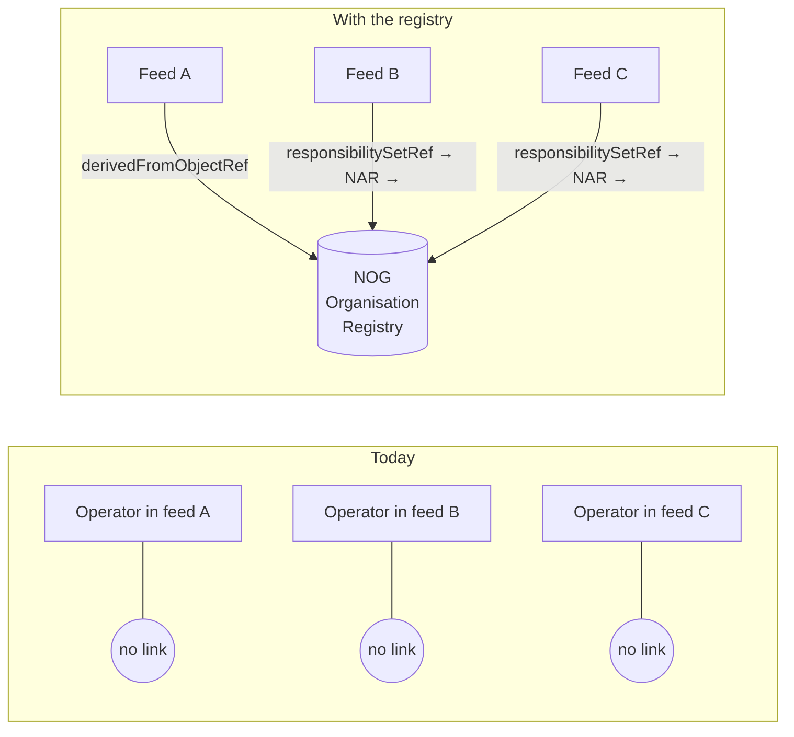
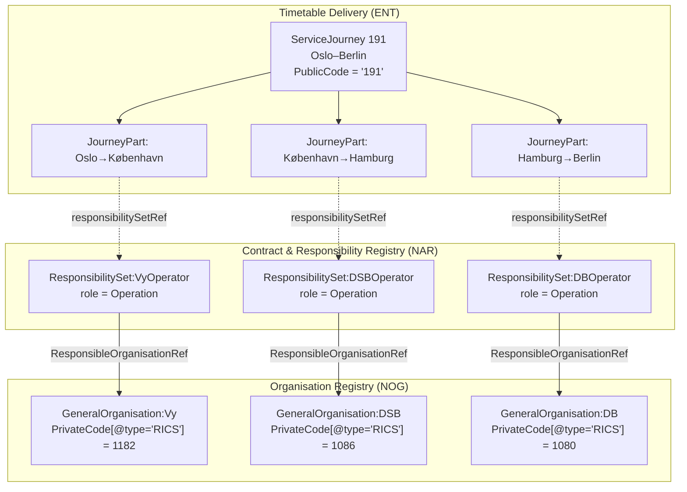

# One journey, three operators, zero workarounds

**A case for the Organisation Registry pattern and three profile
additions that unlock international rail in NeTEx.**

---

## The problem in one sentence

> *"Who operates my train between København and Hamburg?"*

Today's profile can't answer that. `OperatorRef` lives on
`ServiceJourney` — the whole journey. When three railways hand off the
same service across borders, we have no standard place to say so.

Internally, the same gap blocks the **organisation registry** from
becoming the single source of truth it should be: if operator identity
can't flow from a central registry down to the individual leg, the
registry is decoration — not infrastructure.

---

## Three proposals, one coherent story

| Change | Internal win (Entur / registry) | External win (UIC / interop) |
|--------|--------------------------------|------------------------------|
| Always type `PrivateCode` | Registry codes (RICS, UIC station) become queryable, not guesswork | Machine-readable profile; validators can target `[@type='RICS']` directly |
| `GeneralOrganisation` + `ResponsibilitySet` | The org registry becomes the **authoritative source** — operator identity flows from NOG through NAR into every JourneyPart | Per-leg operator without schema change; through-coach services modelled natively |
| One SJ = one passenger opportunity | One bookable entity in sales systems, segmented operationally underneath | Through coaches answered by a single query, not a graph walk over host-train attachments |

---

## Why the registry pattern matters internally



**Today:** every feed invents its own `Operator` object. RICS codes are
duplicated (or missing). When the same railway appears in three feeds,
there's no guarantee the data matches — and no master to reconcile
against.

**With the registry:** `NOG:GeneralOrganisation:Vy` is defined **once**.
Feeds reference it. The registry owns the RICS code, the name, the
contact details. Feeds own the *roles* (who operates what), expressed
through `ResponsibilitySet`.

---

## The architecture



**One pattern, inherited downward:**

```
Level where responsibilitySetRef is set:

  Line                  ← default (most services)
    ServiceJourney      ← overrides Line (some services)
      JourneyPart       ← overrides SJ (multi-operator international)

Lookup (same at every level):
  @responsibilitySetRef
    → ResponsibilitySet / ResponsibilityRoleAssignment
      → GeneralOrganisation / PrivateCode[@type='RICS']
```

If absent on JourneyPart, inherit from ServiceJourney. If absent
there, inherit from Line. The **pattern** is always the same — only
the **level** changes based on how complex the service is. Most
domestic services never need it below Line.

---

## Concrete changes needed

### 1. NSR: typed `PrivateCode` on StopPlace and Quay

The National StopPlace Registry (NSR) should support `PrivateCode` **with
`type`** — specifically `type="uicCode"` for UIC station codes on
StopPlace, and future-proofed for Quay as well:

```xml
<StopPlace id="NSR:StopPlace:OsloS" version="1">
    <privateCodes>
        <PrivateCode type="uicCode">007600100</PrivateCode>
    </privateCodes>
    <Name>Oslo S</Name>
    <quays>
        <Quay id="NSR:Quay:OsloS_1" version="1">
            <privateCodes>
                <PrivateCode type="uicCode">007600101</PrivateCode>
            </privateCodes>
            <Name>Spor 1</Name>
        </Quay>
    </quays>
</StopPlace>
```

Today NSR may carry UIC codes, but without `type` they are not
machine-distinguishable from other private codes on the same object.
Adding `type` support on Quay now avoids a second migration later when
platform-level UIC codes are needed for international interoperability.

**Why `PrivateCode` and not `KeyValue`?** NeTEx also has `keyList` /
`KeyValue` — a generic key-value bag on every managed object. Both live
in `DataManagedObjectGroup`, but they serve different purposes:

| | `PrivateCode` | `KeyValue` |
|---|---|---|
| **Semantics** | Purpose-built: "this object is known by this code in external system X" | Generic extension: "attach arbitrary data" |
| **XPath** | `PrivateCode[@type='uicCode']` | `KeyValue[Key='uicCode']/Value` |
| **Schema support** | `type` is a native attribute — profiles can constrain vocabulary via Schematron | `Key` is free text — no schema-level vocabulary control |
| **Intended use** | External identifiers and coding systems | Implementation-specific extensions, not part of the semantic model |

`PrivateCode` says *"this is an identity in another system"* —
which is exactly what RICS codes and UIC station codes are.
`KeyValue` says *"here's some extra data"* — which invites
uncontrolled growth and makes validation impossible.

### 2. `ResponsibilitySet` as the primary carrier of responsibility and role

Replace `OperatorRef` / `AuthorityRef` as the **primary** mechanism for
expressing who does what. `ResponsibilitySet` carries both the
organisation reference and the stakeholder role, and works at every
level:

| Level | When to set `responsibilitySetRef` |
|-------|-------------------------------------|
| **Line** | Default operator for all journeys on the line (most common) |
| **ServiceJourney** | When the SJ operator differs from the Line default |
| **JourneyPart** | When the operator changes mid-journey (international, through coaches) |

`OperatorRef` / `AuthorityRef` remain valid for backward compatibility
but are no longer the recommended pattern.

### 3. Typed `PrivateCode` in timetable data

Operators delivering timetable data use `PrivateCode` with `type` on
their own objects — primarily `type="RICS"` on `GeneralOrganisation`:

```xml
<GeneralOrganisation id="NOG:GeneralOrganisation:Vy" version="1">
    <privateCodes>
        <PrivateCode type="RICS">1182</PrivateCode>
    </privateCodes>
    <Name>Vy Tog AS</Name>
</GeneralOrganisation>
```

The vocabulary is open — `RICS`, `uicCode`, `marketingCode`,
`legacySystemId`, etc. — but `type` is **always required**.

### 4. `derivedFromObjectRef` for local Operator / Authority

Feeds that need a local `Operator` or `Authority` (e.g. for legacy
consumer compatibility) link it back to the registry's
`GeneralOrganisation` via `derivedFromObjectRef`:

```xml
<!-- In the operator's own ResourceFrame -->
<Authority id="ENT:Authority:Vy" version="1"
           derivedFromObjectRef="NOG:GeneralOrganisation:Vy"/>
<Operator id="ENT:Operator:Vy" version="1"
          derivedFromObjectRef="NOG:GeneralOrganisation:Vy"/>
```

This preserves the traceability chain: a consumer seeing
`ENT:Operator:Vy` can resolve back to the canonical registry entry and
its RICS code. The `GeneralOrganisation` in NOG remains the single
source of truth; the local `Operator` / `Authority` is a
role-specialised projection of it.

---

## What this does NOT require

| Concern | Answer |
|---------|--------|
| CEN schema change? | **No.** All three proposals use existing NeTEx elements. |
| Breaking change for current producers? | **No.** `OperatorRef` still works; `responsibilitySetRef` is additive. |
| New infrastructure? | **Minimal.** NOG and NAR are reference-data frames — static, versioned, cacheable. |
| Complex migration? | **No.** Add `type` to existing `PrivateCode`s. Emit `ResponsibilitySet` alongside existing `OperatorRef`. Consumers fall back gracefully. |

---

## The compound payoff

When all three work together:

- **Oslo → Berlin** is one `ServiceJourney` with `PublicCode "191"`,
  three `JourneyPart`s, three `responsibilitySetRef`s — Vy, DSB, DB.
- **RICS extraction** for EDIFACT export is one XPath per leg.
- **The registry is the master.** Change Vy's RICS code in NOG; every
  feed that references it picks up the change at next delivery. No
  grep-and-replace across feeds.
- **Validators get teeth.** "Every `JourneyPart` on an international
  `Line` MUST carry `responsibilitySetRef`" is a checkable rule, not a
  gentleman's agreement.
