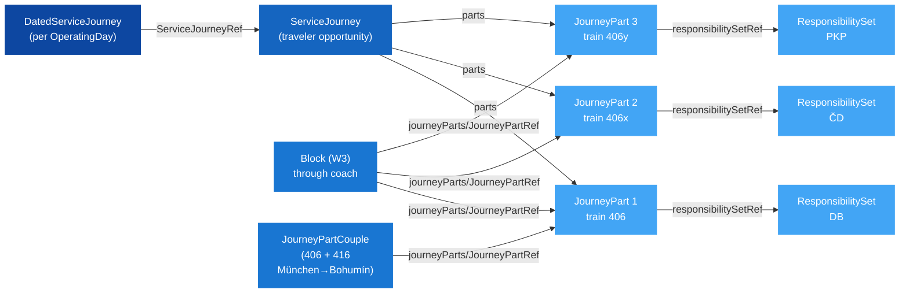

# 🚂 Through-Coach Services — Case Study Guide

## 1. 🎯 Introduction

A **through coach** is a passenger coach (or set of coaches) that stays coupled
with the same travelers seated in it across what are operationally **multiple
trains** — different locomotives, crews, and train numbers — so the passenger
experiences one journey while the railway operates several. They are common on
night services and cross-border routes (e.g. München → Wien → Břeclav → Bohumín
→ Warszawa) and they break a number of assumptions baked into simpler timetable
models:

- One ticket spans several trains.
- The "train number" changes mid-journey.
- Different operators are responsible for different legs.
- The same physical coaches may be coupled with another service for part of the
  route, then split off again.

This guide describes how the UIC NeTEx profile models such services from a
**passenger-opportunity perspective** — one journey for the traveller, even
though the railway operates several trains underneath. Two validated example
files ship with this guide: a [TimetableFrame](Example_ThroughCoaches_Timetable.xml)
with six ServiceJourneys covering night April 23/24, 2026, and the matching
[Locations file](Example_ThroughCoaches_Locations.xml) with 33 StopPlaces.

In this guide you will learn:
- 🎯 Why a through coach is one traveler opportunity but several operational trains
- 🧩 How `ServiceJourney`, `JourneyPart`, `JourneyPartCouple` and `Block` divide the work
- 🗂️ Where the per-leg train number, RICS and responsibility belong
- ✅ Which converter behaviour is supported today and which is still open

---

## 2. 🧠 Core Concepts

### Three layers, one journey

| Layer | NeTEx object | Identity scope | Holds |
|---|---|---|---|
| Traveler opportunity | `ServiceJourney` | Stable across timetable periods | Unified `passingTimes` for the full route, primary train number and `Name` |
| Operational leg | `JourneyPart` (inside `parts`) | Stable within the SJ | Per-leg train number, responsible operator, `From`/`To` stop, `StartTime`/`EndTime` |
| Physical coach path | `Block` / `BlockPart` (in `VehicleScheduleFrame`) | Stable across re-publications | The coach's wagon-level path through one or more `JourneyPart`s |
| Coupled section | `JourneyPartCouple` (in `TimetableFrame`) | — | Two parallel `JourneyPart`s that share track and consist (e.g. 406+416 between München and Bohumín) |

The dated instance — the thing a booking actually points at — is a
`DatedServiceJourney` per `OperatingDay`. See the
[Calendar Guide](../Calendar/Calendar_Guide.md) for why dated instances are the
profile's primary calendar source, and the
[Stable Identity Guide](../StableIdentity/StableIdentity_Guide.md) for why the
DSJ id (not the train number) is the long-term sales/operational key.

### Why split the journey at all?

`JourneyPart` boundaries should sit at points where **operational identity
genuinely changes**. In practice that means:

- A loco swap and crew change (almost always at a border or a major node).
- A change of responsible operator (different RU, different RICS).
- A change of train number assigned by the IM for path-management reasons.

Splitting on every commercial stop is wrong — `JourneyPart` is for
**operational** segmentation, not editorial.

> [!NOTE]
> **Brand changes are not split drivers.** Operator and brand are correlated in
> the common through-coach case (CHOPIN changes both at every border), but they
> are independent dimensions. A single RU can rebrand a service mid-route
> without changing operator; conversely, an operator handover at a border rarely
> changes the customer-facing brand. Driving `JourneyPart` boundaries from
> branding would import marketing decisions into operational data — the wrong
> direction.
>
> More fundamentally: the profile's purpose is to give the traveller their
> journey opportunity and to give the system enough data to show, offer and
> issue a ticket. For that, `DatedServiceJourney` + `StopPlace` is sufficient.
> Operator, brand and train number are operational detail that downstream systems
> *may* consume, but they are not load-bearing for the traveller transaction and
> should not distort the journey model.

### Why couple, why block?

- **`JourneyPartCouple`** captures two distinct ServiceJourneys whose JourneyParts
  run physically together for a stretch (same path, coupled consist). The two SJs
  retain independent identity, schedules and tickets; the couple records that
  they share track for that section.
- **`Block` / `BlockPart`** captures the coach's physical lifecycle — which
  JourneyParts the same wagon executes in sequence, including coupling and
  splitting events. A through coach's identity lives on the block, not on any
  single ServiceJourney.

---

## 3. 🧭 How It Works in NeTEx

### Element ordering (NeTEx 2.0 schema)

The NeTEx 2.0 XSD is strict about ordering inside `ServiceJourney`:

- `DataManagedObjectGroup`: `privateCodes` **before** `Name`.
- `ServiceJourneyPartsGroup`: `parts` **after** `passingTimes`.

Mixing these up produces XSD failures even when the content is otherwise
correct.

### Where things live

| Concern | Frame | Element |
|---|---|---|
| Unified passing times for the full traveler opportunity | `TimetableFrame` | `ServiceJourney/passingTimes/TimetabledPassingTime` |
| Per-leg operational segmentation | `TimetableFrame` | `ServiceJourney/parts/JourneyPart` |
| Coupled section between two SJs | `TimetableFrame` | `journeyPartCouples/JourneyPartCouple` |
| Through-coach physical path | `VehicleScheduleFrame` | `blocks/Block` + `blockParts/BlockPart` |
| Per-leg responsibility | `TimetableFrame` (and `ResourceFrame` for the set itself) | `JourneyPart/@responsibilitySetRef` → `ResponsibilitySet` |
| Stop ↔ quay binding | `ServiceFrame` | `PassengerStopAssignment` |
| Stable physical identity | `SiteFrame` | `StopPlace`, `Quay`, `privateCodes/PrivateCode[@type='uicCode']` |

### Reference pattern



### Identity discipline

- The **booking** holds a `DatedServiceJourneyRef`, never a train number plus
  date. Renumbering 406 → 408 mid-season changes the `PrivateCode` on the SJ
  and JP but does not touch the DSJ id, so booked tickets remain valid.
- Each `JourneyPart` carries its own `PrivateCode[@type='trainNumber']`. The
  EDIFACT-derived "tognummer" lives **here**, not implied from the SJ.
- Per-leg operator is carried via `responsibilitySetRef` into a
  `ResponsibilitySet` → `GeneralOrganisation` (with RICS as a `PrivateCode`),
  not by repeating RICS on every part.

> [!NOTE]
> The `GeneralOrganisation` + `ResponsibilitySet` pattern used here is a profile
> evolution proposal (P-002) surfaced by this case study, not the legacy
> `Operator` + `OperatorRef` pattern still seen in older Nordic feeds. See
> [ProfileEvolution_Proposals.md](../ProfileEvolution/ProfileEvolution_Proposals.md).

---

## 4. 📝 Worked Example — Service 406 *CHOPIN*

The case study models the night of 23/24 April 2026 with six ServiceJourneys
(476, 456, 406, 416, 576, 443). Service 406 *CHOPIN* runs München → Warszawa
Wschodnia and changes train number twice along the way:

| Leg | From → To | Train no. | Operator |
|---|---|---|---|
| 1 | München → Břeclav | `406` | DB |
| 2 | Břeclav → Bohumín | `406x` | ČD |
| 3 | Bohumín → Warszawa Wschodnia | `406y` | PKP IC |

Between München and Bohumín, the consist is coupled with service `416`
(`JourneyPartCouple`). Specific through coaches are tracked as `Block` *W3*
across all three JourneyParts.

```xml
<ServiceJourney id="PE:ServiceJourney:sj003" version="1"
                responsibilitySetRef="PE:ResponsibilitySet:1251">
  <privateCodes>
    <PrivateCode type="trainNumber">406</PrivateCode>
  </privateCodes>
  <Name>406 CHOPIN</Name>

  <passingTimes>
    <TimetabledPassingTime id="PE:TimetabledPassingTime:sj003_001" version="1">
      <StopPointInJourneyPatternRef ref="PE:StopPointInJourneyPattern:sj003_001" version="1"/>
      <DepartureTime>18:35:00</DepartureTime>
    </TimetabledPassingTime>
    <!-- … 9 more passing times: München → … → Warszawa Wschodnia … -->
  </passingTimes>

  <parts>
    <JourneyPart id="PE:JourneyPart:sj003_p01" version="1"
                 responsibilitySetRef="PE:ResponsibilitySet:1155">
      <privateCodes><PrivateCode type="trainNumber">406</PrivateCode></privateCodes>
      <MainPartRef ref="PE:ServiceJourney:sj003"/>
      <FromStopPointRef ref="PE:ScheduledStopPoint:ssp016"/>  <!-- München -->
      <ToStopPointRef   ref="PE:ScheduledStopPoint:ssp007"/>  <!-- Břeclav -->
      <StartTime>18:35:00</StartTime>
      <EndTime>00:34:00</EndTime>
    </JourneyPart>

    <JourneyPart id="PE:JourneyPart:sj003_p02" version="1"
                 responsibilitySetRef="PE:ResponsibilitySet:1181">
      <privateCodes><PrivateCode type="trainNumber">406x</PrivateCode></privateCodes>
      <MainPartRef ref="PE:ServiceJourney:sj003"/>
      <FromStopPointRef ref="PE:ScheduledStopPoint:ssp007"/>  <!-- Břeclav -->
      <ToStopPointRef   ref="PE:ScheduledStopPoint:ssp020"/>  <!-- Bohumín -->
      <StartTime>00:34:00</StartTime>
      <EndTime>02:55:00</EndTime>
    </JourneyPart>

    <JourneyPart id="PE:JourneyPart:sj003_p03" version="1"
                 responsibilitySetRef="PE:ResponsibilitySet:1251">
      <privateCodes><PrivateCode type="trainNumber">406y</PrivateCode></privateCodes>
      <MainPartRef ref="PE:ServiceJourney:sj003"/>
      <FromStopPointRef ref="PE:ScheduledStopPoint:ssp020"/>  <!-- Bohumín -->
      <ToStopPointRef   ref="PE:ScheduledStopPoint:ssp023"/>  <!-- Warszawa Wschodnia -->
      <StartTime>03:50:00</StartTime>
      <EndTime>08:23:00</EndTime>
    </JourneyPart>
  </parts>
</ServiceJourney>
```

📄 **Validated example files in this folder:**
- [Example_ThroughCoaches_Timetable.xml](Example_ThroughCoaches_Timetable.xml) — full TimetableFrame with all six ServiceJourneys, `journeyPartCouples` and `blocks`
- [Example_ThroughCoaches_Locations.xml](Example_ThroughCoaches_Locations.xml) — SiteFrame with 33 StopPlaces, UIC codes and coordinates

---

## 5. 🔄 Converter Behaviour Today

The case study's `run_conversion.ps1` runs the canonical NeTEx through both
[TSDUPD](../TSDUPD/TSDUPD_Converter_Guide.md) and
[SKDUPD](../SKDUPD/SKDUPD_Converter_Guide.md) converters. With the current
converter:

| Aspect | Status |
|---|---|
| Stops → TSDUPD `ALS` records (with UIC + coordinates) | ✅ Emitted (33 stops in this case) |
| One SKDUPD `Train` per `ServiceJourney` (PRD + POR records) | ✅ Emitted (6 trains, 51 PORs) |
| Per-leg train number from `JourneyPart/PrivateCode` | ❌ **Not yet** projected to SKDUPD |
| `JourneyPartCouple` (coupled section) | ❌ **Not yet** projected |
| `Block` / `BlockPart` (through coach) | ❌ **Not yet** projected |

The information is preserved in the NeTEx source (it round-trips through XSD
validation and is re-readable), but the EDIFACT mapping for per-leg, couple and
block constructs is the natural next converter increment.

> [!WARNING]
> Until per-`JourneyPart` train numbers are projected, downstream EDIFACT
> consumers will see a single train number for the whole service — the one on
> the `ServiceJourney`. Tools that depend on the leg-level number for crew or
> path information must continue reading the NeTEx source directly.

---

## 5b. 🧭 Profile Philosophy — Passenger-Centric, Not Vehicle-Centric

The UIC EDIFACT 916-1 specification describes through coaches in
**vehicle-centric** terms: a `PRD` segment with **service mode 31** ("coach
group") followed by one or more `RFR+AUE` references identifying the host
trains the coach is attached to at each join/split event. MERITS represents
the same concept with a dedicated service brand `_KW_`.

This profile **deliberately does not adopt that framing**. Through coaches are
modelled as **one `ServiceJourney` per traveller opportunity**, with internal
`JourneyPart`s capturing the operational segmentation (loco/crew/operator/path
change points) and `JourneyPartCouple` capturing where two distinct
ServiceJourneys share track and consist for a stretch.

### Why

- The traveller experiences **one journey**, not a coach hand-off. The data
  model should answer the passenger's question ("can I stay seated?"), not
  the dispatcher's ("which loco hauls this wagon next?").
- A through coach can have **zero, one, or many** host trains along the route.
  EDIFACT mode 31 / `RFR+AUE` accommodates this by repeating Group 8 up to 99
  times per stop, but a profile that anchors on a *single* host introduces a
  primary key that does not exist in reality.
- NeTEx already has the right vocabulary: `ServiceJourney` is the offered
  journey, `JourneyPart` is the operational segment, `JourneyPartCouple` is
  the shared-consist relationship, and `Block`/`BlockPart` (in a
  `VehicleScheduleFrame`) is where wagon-level lifecycle belongs if and when
  a producer needs it.

### Implication for converters

Projecting this NeTEx model down to EDIFACT is necessarily **lossy**, and the
choice of projection is an export-time policy, not part of the profile's
core model. See proposal
[P-005](../ProfileEvolution/ProfileEvolution_Proposals.md#p-005--through-coaches-modelled-as-passenger-opportunity-not-coach-attachment)
for the trade-offs between emitting mode 31, splitting into per-leg mode 37
`PRD`s with `RLS+13+8`/`+11` join/split, or collapsing to a single mode 37
`PRD` with one customer-facing service number.

---

## 6. ✅ Best Practices

> [!TIP]
> - Use `JourneyPart` only where operational identity changes (loco/crew/operator/path), not at every commercial stop.
> - Keep one unified `passingTimes` on the `ServiceJourney`. Do not duplicate stop times per part.
> - Place `passingTimes` **before** `parts`, and `privateCodes` **before** `Name`. The XSD will reject the reverse.
> - Carry per-leg train numbers as `JourneyPart/privateCodes/PrivateCode[@type='trainNumber']`. Do not derive them from the part id.
> - Carry per-leg responsibility via `responsibilitySetRef`, not by repeating RICS on each part.
> - Express coupled sections with `JourneyPartCouple` in the `TimetableFrame`. Express physical through-coach paths with `Block` + `BlockPart` in a `VehicleScheduleFrame`.
> - Bookings reference `DatedServiceJourneyRef`, never `(trainNumber, date)`.
> - When two operators operate two parallel SJs that share consist for a stretch (e.g. 406 + 416), keep the SJs distinct and tie them together with `JourneyPartCouple` — do not merge them into one SJ.

❌ Avoid:

- Putting per-leg train numbers in the `id` of the `JourneyPart`.
- Encoding "couples" or "blocks" by abusing `Notice` or free-text fields.
- Splitting one through-coach into multiple unrelated `ServiceJourney`s — that loses the unified traveler opportunity and breaks DSJ-based bookings.
- Using `Operator` + `OperatorRef` for new feeds where multi-operator splitting is required; prefer `GeneralOrganisation` + `ResponsibilitySet` (proposal P-002) for cleaner per-leg responsibility.

---

## 7. 🧪 Open Items For This Pattern

These are tracked in the case study and remain open for the wider profile:

1. **Real-world train numbers.** The case study uses placeholders `406x`,
   `406y`. Producers should replace these with the actual operational numbers
   from DB/ČD/PKP schedules.
2. **Per-leg projection to EDIFACT.** SKDUPD per-`JourneyPart` PRD records (or
   another MERITS message) for the leg-level train numbers and operators.
3. **Couple/block projection to EDIFACT.** No agreed mapping yet for
   `JourneyPartCouple` or `Block`/`BlockPart` into MERITS segments.
4. **Optional `Note` / `AvailabilityCondition`** to explain loco/crew change
   reasons or to vary dwell times by date.

---

## 8. 🔗 Related Resources

### Guides
- [Stable Identity Guide](../StableIdentity/StableIdentity_Guide.md) — why DSJ id (not train number) anchors bookings and re-publications
- [Calendar Guide](../Calendar/Calendar_Guide.md) — why `DatedServiceJourney` is the canonical calendar source
- [Location Handling Guide](../LocationHandling/LocationHandling_Guide.md) — UIC code carrier and per-station MCT
- [SKDUPD Converter Guide](../SKDUPD/SKDUPD_Converter_Guide.md) — current EDIFACT timetable mapping
- [TSDUPD Converter Guide](../TSDUPD/TSDUPD_Converter_Guide.md) — station data mapping
- [ProfileEvolution Proposals](../ProfileEvolution/ProfileEvolution_Proposals.md) — P-001 (`PrivateCode @type` mandatory), P-002 (`GeneralOrganisation` + `ResponsibilitySet`), P-004 (mode-neutral `ServiceNumber`), P-005 (passenger-centric through-coach modelling)

### Validated examples in this folder
- [Example_ThroughCoaches_Timetable.xml](Example_ThroughCoaches_Timetable.xml) — TimetableFrame with 6 ServiceJourneys (sj001–sj006), JourneyParts and JourneyPartCouples for the München–Wien–Břeclav–Bohumín–Warszawa night corridor
- [Example_ThroughCoaches_Locations.xml](Example_ThroughCoaches_Locations.xml) — SiteFrame with 33 StopPlaces (UIC codes, coordinates where available)

### Frames & Objects
- [TimetableFrame](../../Frames/TimetableFrame/Description_TimetableFrame.md)
- [ServiceFrame](../../Frames/ServiceFrame/Description_ServiceFrame.md)
- [ServiceJourney](../../Objects/ServiceJourney/Description_ServiceJourney.md)
- [DatedServiceJourney](../../Objects/DatedServiceJourney/Description_DatedServiceJourney.md)
- [Interchange](../../Objects/Interchange/Description_Interchange.md)
- [TrainBlock](../../Objects/TrainBlock/Description_TrainBlock.md)
- [ResponsibilitySet](../../Objects/ResponsibilitySet/Description_ResponsibilitySet.md)
